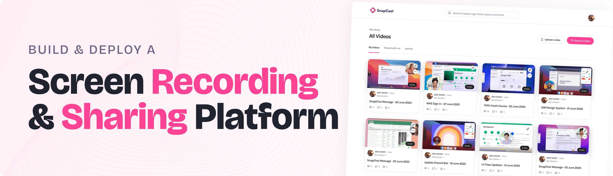

<div align="center">
  <br />
    <a href="https://github.com/chinmaynawkar/screen-sharing-recording-app" target="_blank">
      
    </a>
  <br />

  <div>
    
    
    
  </div>

  <h3 align="center">Full Stack Screen Recording & Video Sharing Platform</h3>

   <div align="center">
     A Full Stack Screen Recording & Video Sharing Platform built by <a href="https://github.com/chinmaynawkar" target="_blank"><b>Chinmay Nawkar</b></a>
    </div>
</div>

## 📋 <a name="table">Table of Contents</a>

1. 🤖 [Introduction](#introduction)
2. ⚙️ [Tech Stack](#tech-stack)
3. 🔋 [Features](#features)
4. 🤸 [Quick Start](#quick-start)
5. 🔗 [Assets](#links)
6. 🚀 [More](#more)

## 🚨 About

This repository contains a Full Stack Screen Recording & Video Sharing Platform developed by <a href="https://github.com/chinmaynawkar" target="_blank"><b>Chinmay Nawkar</b></a>.

The application provides seamless screen recording, video uploading with AI-generated transcripts, privacy controls, and secure sharing capabilities.

## <a name="introduction">🤖 Introduction</a>

Built with Next.js and Bunny.net, this Full Stack Screen Recording & Video Sharing Platform includes user authentication with "Better Auth", screen recording, video uploads, and the ability to share videos via link. Users can set videos as public or private, view AI-generated transcripts, and access metadata like video ID and URL. A built-in search bar makes finding content fast and simple.

**Developed by:** [Chinmay Nawkar](https://github.com/chinmaynawkar)

## <a name="tech-stack">⚙️ Tech Stack</a>

- **[Arcjet](https://arcjet.com)** is a developer-first security platform that integrates bot protection, rate limiting, email validation, and attack protection into your application with minimal code. It offers customizable protection for forms, login pages, and API routes, supporting frameworks like Node.js, Next.js, Deno, Bun, Remix, SvelteKit, and NestJS.

- **[Bunny.net](https://bunny.net)** is a developer-friendly video delivery platform offering global CDN, edge storage, adaptive streaming, and a customizable player. It simplifies video management with features like automatic encoding, token-based security, and real-time analytics. Ideal for seamless, secure, and scalable video streaming.

- **[Better Auth](https://www.better-auth.com/)** is a TypeScript-first authentication and authorization library that simplifies implementing secure login, two-factor authentication, and social sign-ins, all while supporting multi-tenancy.
- **[Drizzle ORM](https://orm.drizzle.team/)** is a type-safe, lightweight ORM for SQL databases, providing a modern solution for interacting with databases using TypeScript, supporting migrations, queries, and schema management.

- **[Next.js](https://nextjs.org/)** is a powerful React framework that enables the development of fast, scalable web applications with features like server-side rendering, static site generation, and API routes for building full-stack applications.

- **[Tailwind CSS](https://tailwindcss.com/)** is a utility-first CSS framework that allows developers to design custom user interfaces by applying low-level utility classes directly in HTML, streamlining the design process.
- **[TypeScript](https://www.typescriptlang.org/)** is a superset of JavaScript that adds static typing, providing better tooling, code quality, and error detection for developers, making it ideal for building large-scale applications.

- **[Xata](https://xata.io)** is a serverless PostgreSQL platform offering auto-scaling, zero-downtime schema migrations, real-time branching, and built-in full-text search. It provides a spreadsheet-like UI for intuitive data management, enhancing modern development workflows.

## <a name="features">🔋 Features</a>

👉 **Authentication**: Secure user sign-up and sign-in with Better-Auth & Google.

👉 **Screen Recording**: Capture your screen directly within the app for seamless video recording.

👉 **Video Uploading**: Effortlessly upload videos with a simple interface, supporting both public and private settings.

👉 **AI Transcripts**: Get AI-generated transcripts for uploaded videos, making content more accessible and searchable.

👉 **Privacy Control**: Toggle video visibility between public and private, ensuring full control over your content.

👉 **Arcjet Integration**: Easily implement bot protection, rate limiting, email validation, and attack protection with minimal code, enhancing your app's security.

👉 **Metadata**: Access video metadata, including unique video ID and URL, for easy sharing and referencing.

👉 **Search Functionality**: Find your videos quickly with an intuitive search bar, streamlining navigation.

👉 **Share Videos**: Share videos via unique links for easy access and distribution.

👉 **Modern UI/UX**: Clean, responsive design built with Tailwind CSS for a sleek user experience.

👉 **Database Integration**: Utilize Xata for real-time, scalable database management.

👉 **Type-Safe Queries**: Benefit from Drizzle ORM’s type-safe queries for secure and efficient database interactions.

👉 **Scalable Tech Stack**: Built with Next.js for a fast, production-ready web application that scales seamlessly.

👉 **Code Reusability**: Leverage reusable components and a modular codebase for efficient development.

👉 **Cross-Device Compatibility**: Fully responsive design that works seamlessly across all devices.

And many more, including enhanced security and optimized video performance!

## <a name="quick-start">🤸 Quick Start</a>

Follow these steps to set up the project locally on your machine.

**Prerequisites**

Make sure you have the following installed on your machine:

- [Git](https://git-scm.com/)
- [Node.js](https://nodejs.org/en)
- [npm](https://www.npmjs.com/) (Node Package Manager)

**Cloning the Repository**

```bash
git clone https://github.com/chinmaynawkar/screen-sharing-recording-app.git
cd screen-sharing-recording-app
```

**Installation**

Install the project dependencies using npm:

```bash
npm install
```

**Set Up Environment Variables**

Create a new file named `.env` in the root of your project and add the following content:

```env
# Next.js
NEXT_PUBLIC_BASE_URL=http://localhost:3000

# [Xata] Configuration used by the CLI and the SDK
# Make sure your framework/tooling loads this file on startup to have it available for the SDK
XATA_API_KEY=
DATABASE_URL_POSTGRES=

# Google
GOOGLE_CLIENT_ID=
GOOGLE_CLIENT_SECRET=

# BetterAuth
BETTER_AUTH_SECRET=
BETTER_AUTH_URL=http://localhost:3000

# Bunny
BUNNY_STORAGE_ACCESS_KEY=
BUNNY_LIBRARY_ID=
BUNNY_STREAM_ACCESS_KEY=
NEXT_PUBLIC_BUNNY_LIBRARY_ID=

#ArcJet
ARCJET_API_KEY=
XATA_API_KEY=
```

Replace the placeholder values with your actual credentials. You can obtain these credentials by signing up on: [Better-Auth](https://www.better-auth.com), [Google Cloud](https://console.cloud.google.com), [Bunny.net](https://bunny.net), [Xata.io](https://xata.io), [Arcjet](https://arcjet.com).

**Running the Project**

```bash
npm run dev
```

Open [http://localhost:3000](http://localhost:3000) in your browser to view the project.

## <a name="links">🔗 Links</a>

- **GitHub Repository**: [https://github.com/chinmaynawkar/screen-sharing-recording-app](https://github.com/chinmaynawkar/vloom-screen-broadcaster-recorder)
- **Author**: [Chinmay Nawkar](https://github.com/chinmaynawkar)

## <a name="more">🚀 More</a>

For questions, suggestions, or contributions, please feel free to open an issue or submit a pull request on the GitHub repository.

**Created with ❤️ by Chinmay Nawkar**
